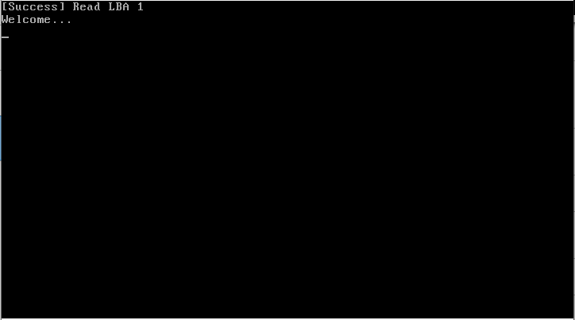

# FoxyOS v0.01
Welcome to the FoxyOS page, OS written in nasm x86. 
FoxyOS is light and fast operation system, with frequent updates.

❗ Attention: there are came out new versions of FoxyOS, support with new updates for this version will end on 01.04.

▪ language in code (Comments) - Russian

▪ Real size (Code) - 3 bytes (+2 bytes - signature)

# Features
- It starts 😀
- No text output 😢
- No user input 😢
- No internet service 😢
- No sounds 😢
- No filesystem 😢

# System Requirements
- CPU: 8086 CPU
- GPU: any
- RAM: 512 byte
- Motherboard: support BIOS

# File hierarchy
1. Build directory - iso images, bin file
2. Source directory - Code of FoxyOS (boot.asm)

# Compile
1. Compile assembly files with nasm to bin file. (Command: nasm -f bin boot.asm -o boot.bin)
2. [For VM] Compile bin file to iso image with UltraISO, PowerISO, etc...
2. [For Real hardware] Rename boot.bin to FoxyOS.iso
3. Done!

# Review

▪ on youtube - https://www.youtube.com/watch?v=TtToONIEczo

